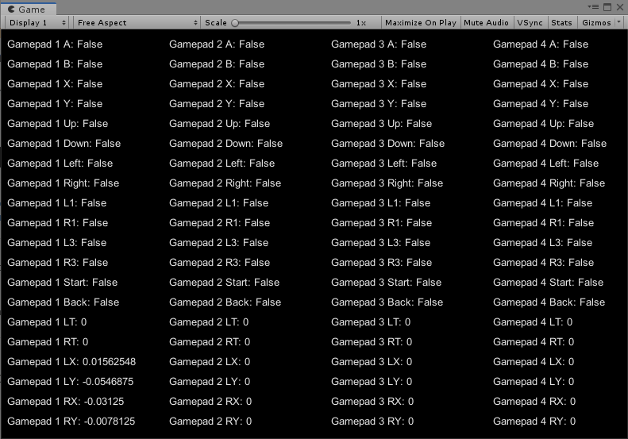

# UnityXpad
Simple input manager for Xbox controllers, or other controllers supported by XInput. This is independent of Unity's native input system, so it won't affect the existing Unity input manager settings. I have experienced input conflicts with native Unity input system when using multiple controllers. 

Supports up to 4 controllers


If your target .Net version is not 4.x, replace the sharpdx and sharpdx.xinput library under Assets/Plugins with the correct version. Both libraries are available on Nuget. 

##Sample Usage

Similar to native Unity input system. For example: 

```
if ( Xpad.GetKey( XKey.A, 1 ))
{
	//Gamepad 1 A button is held
}

if ( Xpad.GetKeyDown( XKey.A, 1 ))
{
	//Gamepad 1 A button is pressed. No continuous detection
}

if ( Xpad.GetKeyUp( XKey.A, 1 )
{
	//Gamepad 1 A button is released. No continuous detection
}

if ( Xpad.GetAxis( XKey.LeftThumbX, 1 ))
{
	//Gamepad 1 Left horizontal axis, ranged from -1 to 1. 
}

if ( Xpad.GetAxisRaw( XKey.LeftThumbX, 1 ))
{
	//Gamepad 1 Left horizontal axis, returns either -1, 0 or 1.
	//This is more useful with Triggers (i.e l2, r2), since the joystick
	//rarely stays at 0 (usually stays at like 0.003 when not pushed). 
}
```